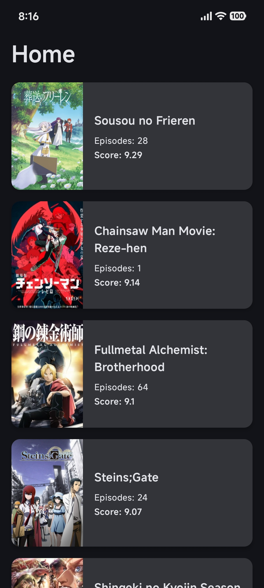

# Seekho Jikan: An Anime Discovery App

Seekho Jikan is a modern Android application built with Kotlin and Jetpack Compose that allows users
to explore the world of anime. It leverages the Jikan API to provide up-to-date information on
top-rated anime series, detailed descriptions, and more. The app is designed with a clean, intuitive
user interface and a robust architecture to ensure a seamless user experience, both online and
offline.

## ✨ Features

- **Discover Top Anime:** Browse a curated list of the top anime series, complete with high-quality
  poster images, ratings, and episode counts.
- **Detailed Information:** Dive deeper into any anime to view its full synopsis, genre tags, and
  other relevant details.
- **Offline Caching:** Powered by Room, the app caches data locally, allowing you to browse
  previously loaded content even without an internet connection.
- **Clean & Modern UI:** A beautifully designed interface built entirely with Jetpack Compose,
  offering a smooth and intuitive user experience.
- **Error Handling:** Gracefully handles network and API errors to keep the user informed.
- **Trailer Support with Graceful Fallback:**
  Anime trailers are displayed using a best-effort inline YouTube player. When embedded playback is
  unavailable due to YouTube restrictions, the app gracefully falls back to displaying the anime
  poster and offers the option to open the trailer in the YouTube app.

## 📸 Screenshots

*(Here you can add screenshots of your app. For example:)*

| Home Screen                          | Details Screen                             |
|--------------------------------------|--------------------------------------------|
|  |  |

## 🏗️ Architecture

This project follows the **Model-View-ViewModel (MVVM)** architecture and Google's recommended guide
to app architecture. This promotes a clean separation of concerns, making the codebase scalable,
testable, and maintainable.

- **UI Layer (View):** Built with Jetpack Compose. The UI observes state changes from the ViewModel
  via `StateFlow` and updates itself accordingly.
- **ViewModel Layer:** Holds the UI state and business logic. It interacts with the Domain layer (
  Use Cases) and exposes state to the UI. `Hilt` is used for injecting dependencies, including
  repositories and use cases.
- **Domain Layer:** Contains the core business logic of the application, encapsulated in Use Cases.
  This layer is independent of the UI and Data layers.
- **Data Layer:** Responsible for providing data to the application. It consists of a Repository
  that fetches data from one or more data sources (a remote API and a local database).

## 🛠️ Tech Stack & Libraries

- **Kotlin:** First-party language for Android development.
- **Jetpack Compose:** Modern toolkit for building native Android UI.
- **Coroutines & Flow:** For asynchronous and reactive programming.
- **MVVM:** Recommended architectural pattern for robust apps.
- **Hilt:** For dependency injection.
- **Retrofit:** For type-safe HTTP calls to the Jikan API.
- **Room:** For local database and offline caching.
- **Glide:** For efficient image loading and caching.
- **Navigation-Compose:** For navigating between composable screens.

## 🔌 API Reference

This app uses the public [Jikan API](https://jikan.moe/) to fetch anime data. The following
endpoints are used:

- `GET /v4/top/anime`: Fetches the top anime series.
- `GET /v4/anime/{id}`: Fetches detailed information for a specific anime.

## 🛑 Known Limitations

- **YouTube Trailer Playback Limitations:** Trailers provided by the Jikan API often link to YouTube
  videos. YouTube does not guarantee embedded playback in Android apps for all videos due to
  licensing, regional, and policy
  restrictions. The app attempts inline playback using the official YouTube IFrame Player API and
  automatically falls back to displaying the anime poster with an option to open the trailer in the
  YouTube app when embedded playback is unavailable.

## 🤔 Assumptions Made

- The Jikan API is the single source of truth for all anime-related data.
- The app is designed for a mobile-first experience.
- Network availability may be intermittent; therefore, previously fetched data is expected to be
  available offline via local caching.
- YouTube trailers linked via the API may not always be embeddable inside Android applications, and
  the UI is designed to handle this gracefully.
- Poster images and other media assets may be restricted by policy or legal requirements and are
  handled via stable placeholders without breaking layouts. The toggle for this is in
  @/app/src/main/java/com/abhinand/seekhojikan/core/config/FeatureFlags.kt

## 🚀 How to Build

To build and run the project, follow these steps:

1. Clone the repository:
   ```bash
   git clone https://github.com/AbhinandAK350/SeekhoJikan.git
   ```
2. Open the project in Android Studio.
3. Let Android Studio sync the project with Gradle.
4. Build and run the app on an Android emulator or a physical device.